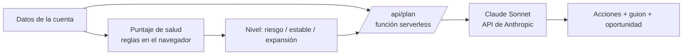

# Cuentómetro — Copiloto de cuentas para Key Account Managers

Herramienta que convierte las señales de una cuenta (uso, satisfacción, soporte, adopción de módulos y renovación) en una **puntuación de salud explicable** y en un **plan de acción redactado con IA**: próximas acciones, guion para la llamada y oportunidad de expansión.

Construida por Alison Navarro para la postulación al rol de Key Account Manager en Alegra.

- **Demo en vivo:** `https://cuentometro.vercel.app`
- **Video:** `https://drive.google.com/file/d/1l10ZCL7_6U7aDdY00qxErHf2lauTTRfx/view?usp=sharing`

---

## 1. El problema

Un KAM maneja decenas de cuentas de pymes a la vez, con señales repartidas en varios sistemas: frecuencia de uso, tickets, NPS, módulos contratados y fecha de renovación. Decidir a qué cuenta llamar hoy, y qué decirle, suele depender de la intuición o de la cuenta que más ruido hizo esa semana.

Eso produce dos fallas típicas del rol:

- Cuentas en riesgo real de no renovar que no reciben atención porque nunca abrieron un ticket.
- Cuentas sanas donde se pierde una expansión (por ejemplo, una firma contable que usa facturación pero no nómina) porque nadie las miró con ese lente.

Me importaba resolver el paso previo a cualquier conversación con el cliente: tener un criterio consistente para priorizar y un primer borrador del mensaje adaptado a cada cuenta.

## 2. Mi proceso

Consideré tres caminos:

| Alternativa | Por qué la descarté o la elegí |
| --- | --- |
| Dashboard de BI estático | Muestra datos, pero no resuelve la parte más lenta del trabajo: preparar qué decirle a cada cliente. |
| Chatbot libre sobre la cartera | Demasiado abierto y poco explicable: no deja ver por qué recomienda lo que recomienda. |
| **Puntaje con reglas visibles + IA para el plan** | **Elegido.** Separa lo que debe ser auditable (el puntaje) de lo que requiere criterio y redacción (el plan de acción). |

Antes de construir investigué cómo Alegra describe su propio equipo de Customer Success: en sus vacantes habla de entender a fondo los objetivos del cliente, ser asesores de confianza y trabajar con foco en retención y aumento de ingresos. El Cuentómetro está diseñado alrededor de ese mandato: retener primero, expandir cuando la cuenta está sana.

## 3. Qué construí



**Capa 1: puntaje de salud (0–100).** Se calcula en el navegador con pesos visibles:

| Factor | Peso |
| --- | --- |
| Frecuencia de uso | 30% |
| Satisfacción (NPS) | 25% |
| Soporte e incidencias abiertas | 20% |
| Adopción de módulos | 15% |
| Cercanía de la renovación | 10% |

Se resta una penalización extra cuando la renovación está a menos de 30 días y el uso es bajo. El resultado se clasifica en alto riesgo (0–40), estable (41–70) o saludable con oportunidad de expansión (71–100).

**Capa 2: plan de acción con IA.** Al pulsar *Generar plan de acción con IA*, la página envía los datos de la cuenta a una función serverless que llama a Claude a través de la API de Anthropic. El modelo actúa como KAM de Alegra y devuelve tres acciones priorizadas, un guion de llamada y una oportunidad de expansión, todo específico a esa cuenta.

La herramienta incluye tres cuentas de ejemplo (una ferretería en riesgo moderado, una firma contable sana y una boutique nueva en riesgo alto) para mostrar el rango completo.

### Herramientas y modelos

| Uso | Herramienta |
| --- | --- |
| Investigación, diseño del puntaje y construcción del código | Claude (claude.ai) |
| Generación del plan en producción | Claude Sonnet vía API de Anthropic (`claude-sonnet-5`) |
| Interfaz | HTML, CSS y JavaScript, sin frameworks |
| Backend | Función serverless en Node.js |
| Código y hosting | GitHub + Vercel |

### Decisiones de diseño

- **La API key nunca llega al navegador.** Vive como variable de entorno en Vercel.
- **El prompt se arma en el servidor.** La página solo envía datos de la cuenta, así el endpoint no sirve para pedirle otra cosa al modelo.
- **Entradas acotadas.** Cada campo se recorta y valida antes de enviarse al modelo.
- **Plan de respaldo.** Si la API no responde, las cuentas de ejemplo muestran un plan precargado, marcado como tal.

## 4. El resultado

### ¿Qué cambió a partir de esto?

Cada cuenta deja de gestionarse por percepción y pasa a analizarse con criterios concretos y los mismos para toda la cartera. En lugar de reaccionar a la cuenta que más ruido hace, el KAM ve de un vistazo qué cuenta necesita atención, por qué y qué hacer con ella. Eso permite actuar con más precisión, con una estrategia clara para cada cliente y, sobre todo, a tiempo: antes de que una cuenta en riesgo decida no renovar o de que una oportunidad de expansión se enfríe.

Los tres ejemplos muestran ese cambio en la práctica:

- **Ferretería (México):** estable, pero con tickets abiertos y renovación cercana → la prioridad es retener y resolver el dolor de su contador con el módulo de Contabilidad.
- **Firma contable (Colombia):** NPS alto y uso diario → la prioridad es expandir, con usuarios adicionales y la firma como canal de referidos.
- **Boutique (Perú):** uso bajo, tickets sin resolver y renovación en 9 días → la prioridad es rescatar la cuenta, sin venta adicional por ahora.

Tres cuentas, tres estrategias distintas, cada una justificada con datos.

### ¿Qué impacto tiene?

1. **Tiempo optimizado según prioridad y urgencia.** El KAM dedica su tiempo primero a las cuentas que más lo necesitan, y llega a cada llamada con las acciones y el guion ya preparados, en vez de armarlos desde cero.
2. **Un plan estructurado por cuenta.** Cada cliente tiene acciones concretas, un mensaje definido y una oportunidad identificada, lo que permite hacer seguimiento a la estrategia y medir si se cumplió.
3. **Más revenue, protegido y expandido.** Detectar a tiempo los desafíos de una cuenta evita perder ingresos por no renovación, e identificar sus oportunidades permite crecerla con el módulo o la propuesta correcta en el momento correcto.

La IA redacta el primer borrador del plan; la decisión final sigue siendo del KAM. El objetivo es que ninguna cuenta en riesgo pase inadvertida y que ninguna oportunidad de expansión se quede sin trabajar.

## 5. Lo que sigue

- **Datos reales en vez de manuales:** conectar CRM, uso de producto y encuestas para calcular los factores automáticamente.
- **Pesos calibrados:** ajustar los pesos del puntaje con el historial real de renovaciones, en lugar de pesos definidos por criterio.
- **Vista de cartera:** todas las cuentas de un KAM ordenadas por riesgo, para planear la semana en una sola pantalla.

---

## Cómo desplegarlo

1. **API key de Anthropic.** Crear cuenta en [console.anthropic.com](https://console.anthropic.com), cargar créditos, generar una API key y fijar un límite de gasto mensual.
2. **Vercel.** Entrar a [vercel.com](https://vercel.com) con GitHub, importar este repositorio y agregar la variable de entorno `ANTHROPIC_API_KEY`. Deploy.
3. Abrir el link resultante en una ventana de incógnito para verificar.

Sin la variable configurada, la página funciona igual: el puntaje se calcula normal y las cuentas de ejemplo muestran su plan precargado.

## Estructura

```
index.html      Interfaz y cálculo del puntaje
api/plan.js     Función serverless que llama a Claude
package.json    Configuración mínima de Node
.env.example    Plantilla de variables (no subir la clave real)
```
